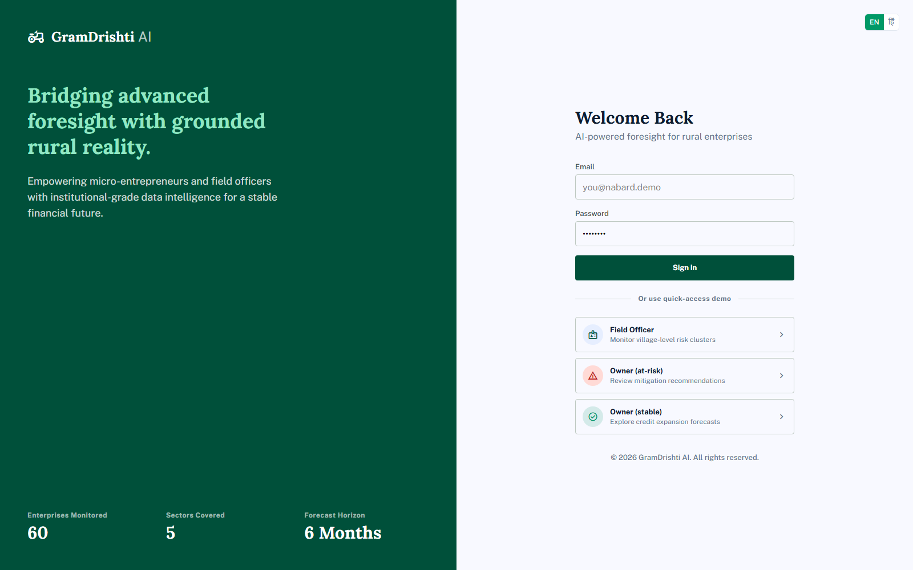
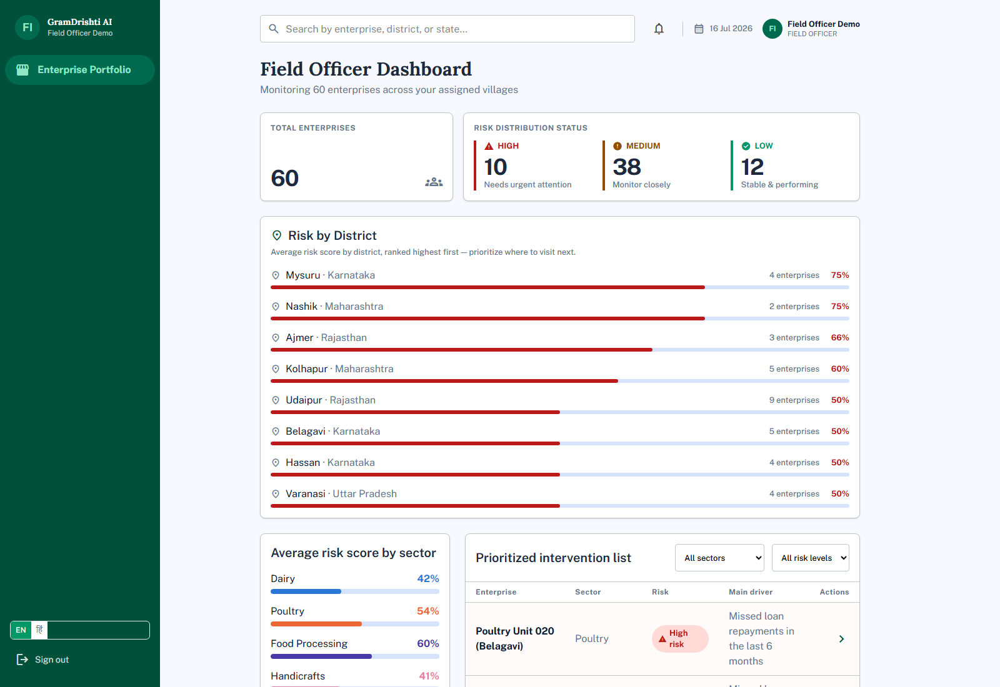
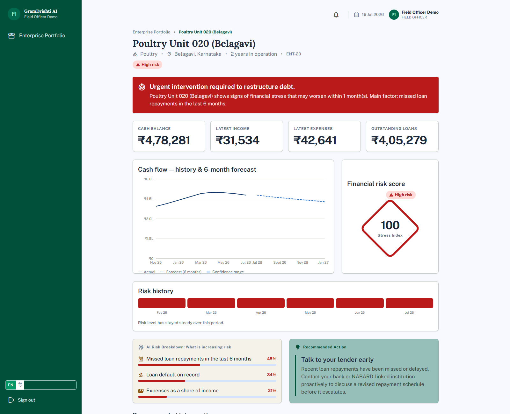
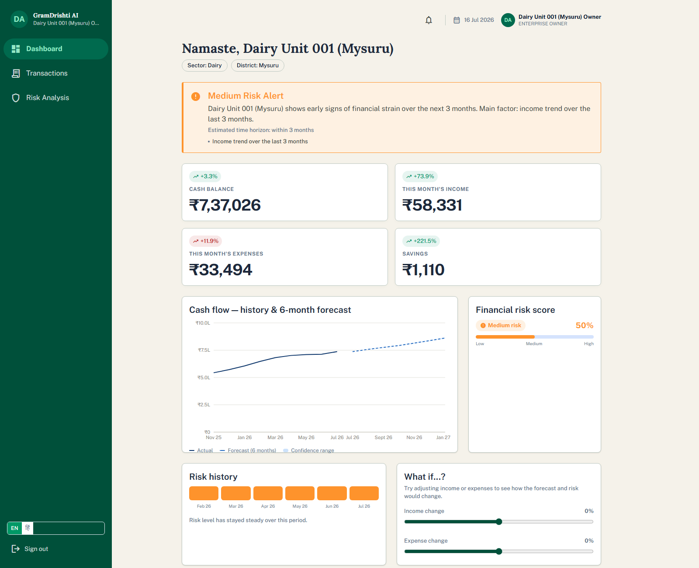
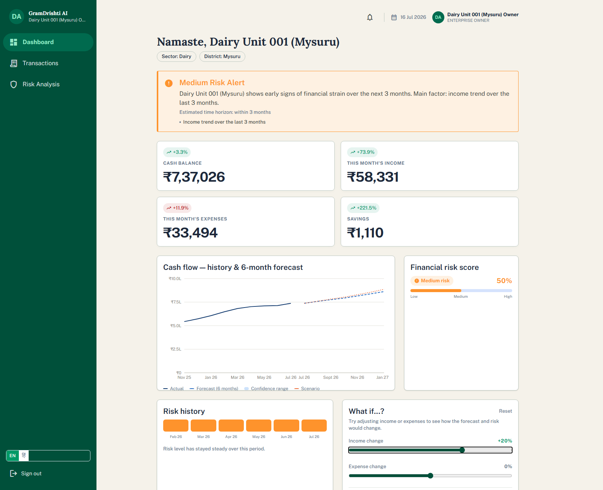
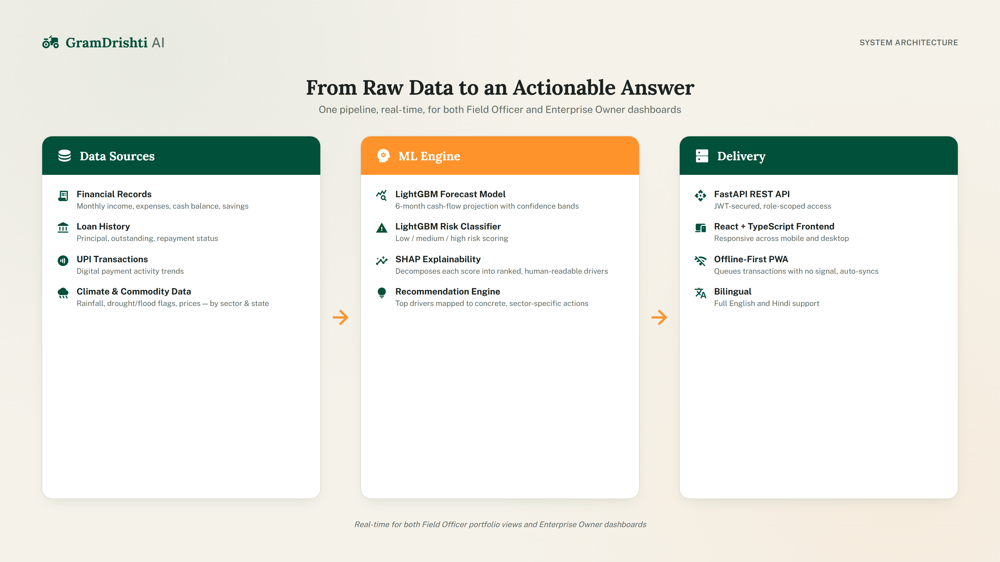

# 🌾 GramDrishti AI
### AI-powered foresight for rural enterprises



> *"Gram" (village) + "Drishti" (vision) — seeing financial trouble coming before it arrives.*

Built for the **NABARD Hackathon**, GramDrishti AI predicts the financial health of rural micro-enterprises **6 months ahead**, explains *why* risk is rising in plain language, and tells both the enterprise owner and the NABARD field officer what to do about it — before a missed payment turns into a default.

---

## ✨ What it does

- 🔮 **6-month cash-flow forecasting** — LightGBM regressor, with a confidence band
- ⚠️ **Explainable risk scoring** — Low / Medium / High, decomposed into real SHAP-ranked drivers, not a black box
- 💡 **Actionable recommendations** — sector-specific advice tied to the actual risk drivers, not generic tips
- 🎚️ **What-if simulator** — drag income/expense sliders and watch the forecast + risk update live
- 🗺️ **Portfolio view for field officers** — risk distribution, risk-by-district, sector breakdown, a prioritized visit list
- 🌦️ **Real climate risk** — rainfall/drought/flood data by sector + state feeds directly into the model
- 📶 **Offline-first** — transactions queue locally with no signal and auto-sync when back online
- 🌐 **Bilingual** — full English + Hindi UI
- 🔔 **Real alerts feed** — portfolio-wide for officers, personal history for owners

## 📸 Screenshots

| Field Officer Portfolio | Enterprise Detail — Explainable AI |
|---|---|
|  |  |

| Enterprise Owner Dashboard | What-If Simulator |
|---|---|
|  |  |

## 🏗️ Architecture



**Backend:** FastAPI · SQLAlchemy · SQLite · LightGBM (forecast + risk models) · SHAP
**Frontend:** React 18 · TypeScript · Tailwind CSS v4 · TanStack Query · Dexie (offline queue) · vite-plugin-pwa · i18next

## 🚀 Running it

### Backend
```bash
cd backend
python -m venv venv
venv/Scripts/python.exe -m pip install -r requirements.txt   # venv/bin/... on macOS/Linux
venv/Scripts/python.exe -m app.data_gen.seed                 # generate synthetic data
venv/Scripts/python.exe -m app.ml.train                      # train forecast + risk models
venv/Scripts/python.exe -m uvicorn main:app --port 8000
```

### Frontend
```bash
cd frontend
npm install
npm run dev   # http://localhost:5173
```

### 🔑 Demo logins (password: `demo1234`)

| Role | Email |
|---|---|
| 🧑‍💼 Field Officer | `officer@nabard.demo` |
| ⚠️ Owner (at-risk) | `owner1@nabard.demo` |
| ✅ Owner (stable) | `owner2@nabard.demo` |

## 🧠 How the ML works

1. **Data** — 60 synthetic enterprises across 5 sectors, joined with loan history, UPI activity, and real rainfall/drought/flood/commodity data per sector + state + month
2. **Forecast** — a LightGBM regressor projects next-month cash-balance deltas, applied recursively for a 6-month horizon
3. **Risk** — a LightGBM classifier (Low/Medium/High) trained on rule-bootstrapped labels, so it generalizes the pattern instead of just replaying a rule
4. **Explain** — SHAP TreeExplainer decomposes every prediction into ranked, human-readable drivers
5. **Recommend** — the top risk-increasing driver maps to a concrete, sector-aware action

## 📎 More

- 🖥️ Full pitch deck: [`pitch-deck-assets/GramDrishti-AI-Pitch-Deck.pptx`](pitch-deck-assets/GramDrishti-AI-Pitch-Deck.pptx)
- 📄 Demo walkthrough: [`docs/demo_script.md`](docs/demo_script.md)

## 🚧 Known limitations

- Not yet deployed — runs locally only
- No automated test suite (verified via manual + scripted checks)
- Backend-generated risk messages and recommendation text are English-only (UI chrome is fully bilingual)

---

## 👥 Team

### Team LoneWolf

Built solo for the NABARD Hackathon by **Anubhav Harsh Sinha**

🔗 [LinkedIn](https://www.linkedin.com/in/anubhav-sinha-a70019287/)

---

<p align="center"><i>GramDrishti AI — seeing financial trouble coming, at the village level.</i></p>
